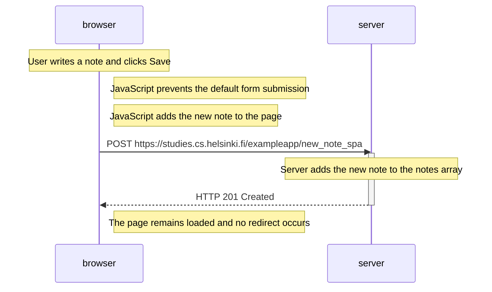

```mermaid
sequenceDiagram
    participant browser
    participant server

    Note over browser: User writes a note and clicks Save

    Note right of browser: JavaScript prevents the default form submission

    Note right of browser: JavaScript adds the new note to the page

    browser->>server: POST https://studies.cs.helsinki.fi/exampleapp/new_note_spa
    activate server
    Note over server: Server adds the new note to the notes array
    server-->>browser: HTTP 201 Created
    deactivate server

    Note right of browser: The page remains loaded and no redirect occurs
```